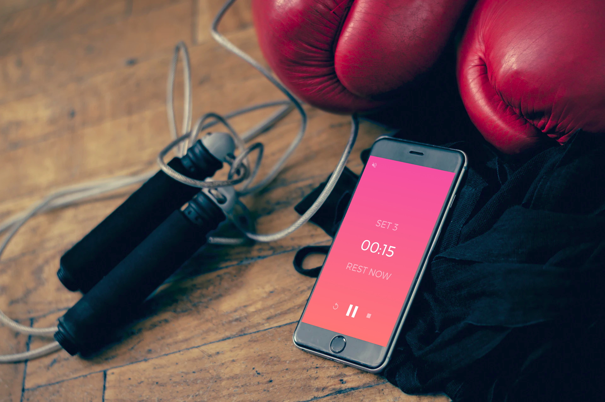
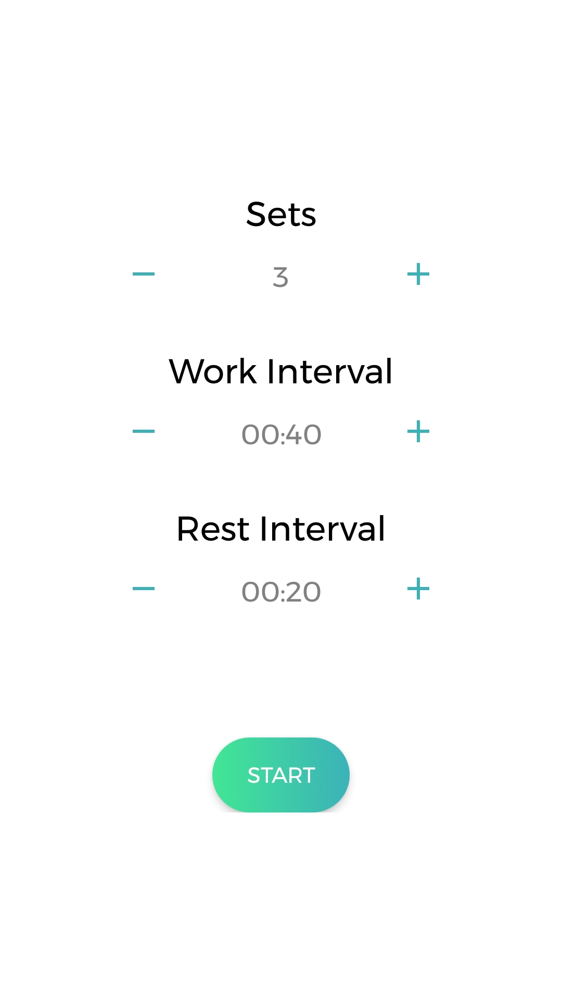
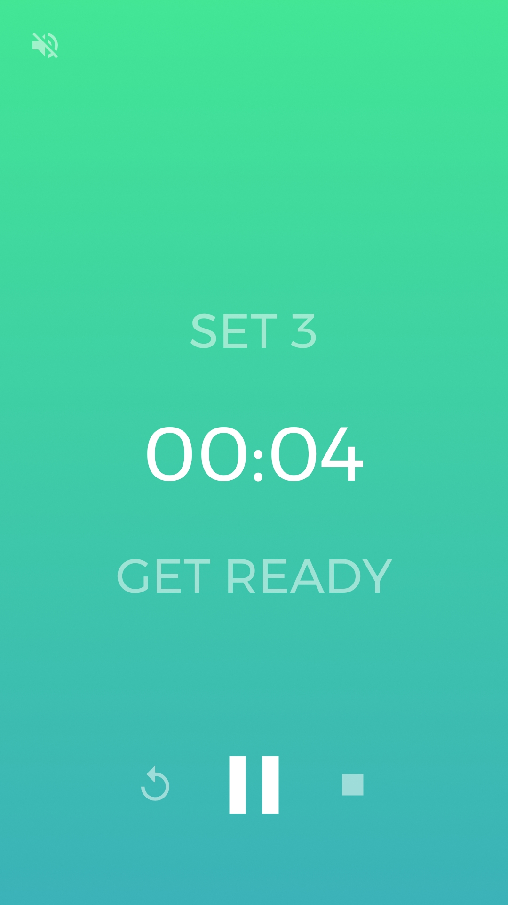
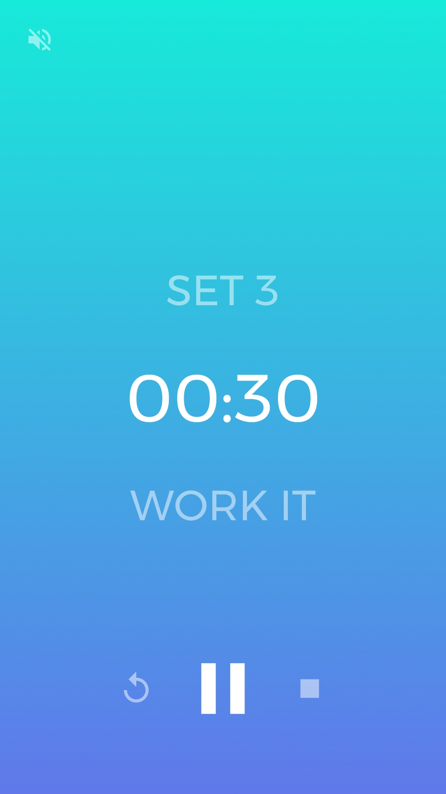
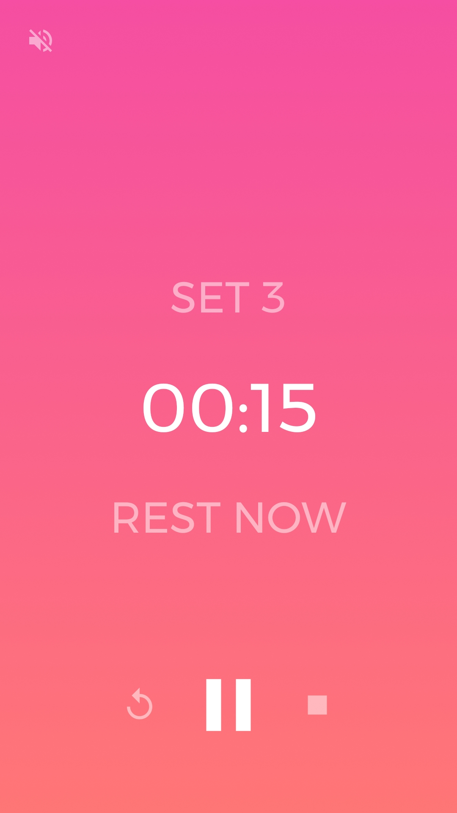
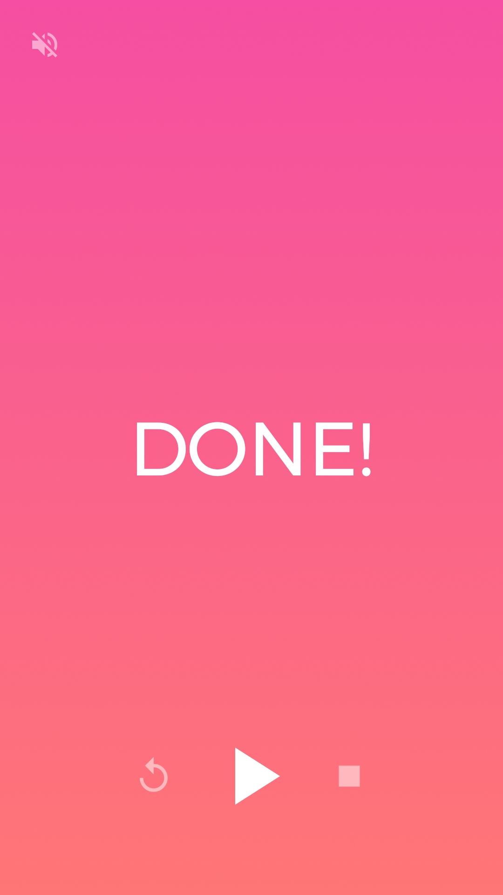

# Interval Timer (Android)

Simplistic interval timer for Android.
Useful for HIIT, Tabata or Boxe workouts.

 

## Screenshots

 

 

## License
This project is licensed under the MIT License - see the [LICENSE] file for details.

## Contributing
Contributions are welcome :smile:

### Pull requests
Just a few guidelines:
-   Write clean code with appropriate comments and add suitable error handling.
-   Test the application and make sure no bugs/ issues come up.
-   Open a pull request and I will be happy to acknowledge your contribution after some checking from my side.

### Issues
If you find any bugs/issues, raise an issue.

  [LICENSE]: <LICENSE>